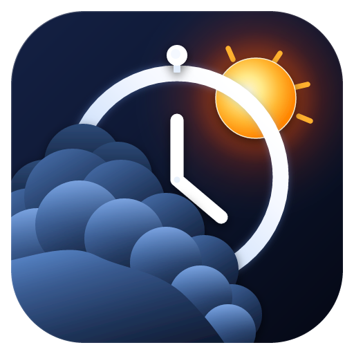
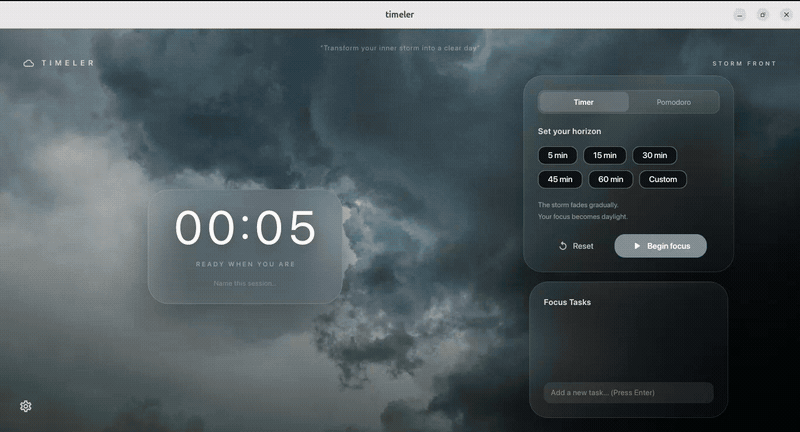
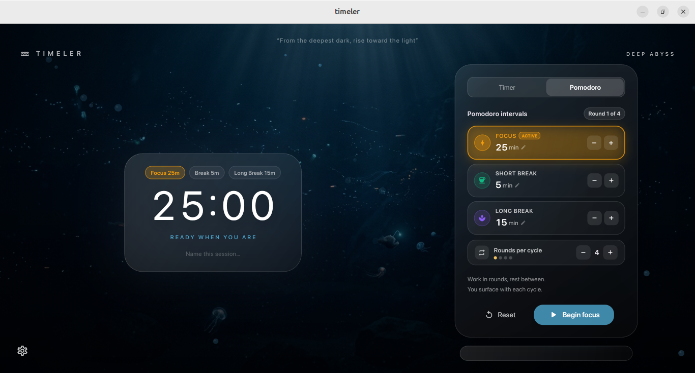
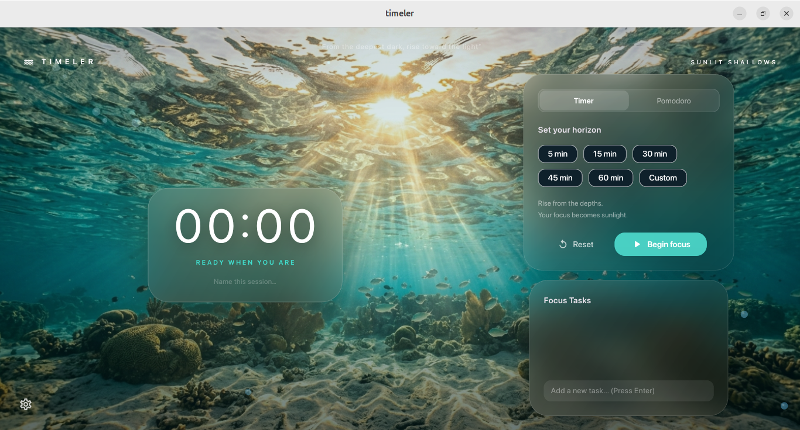
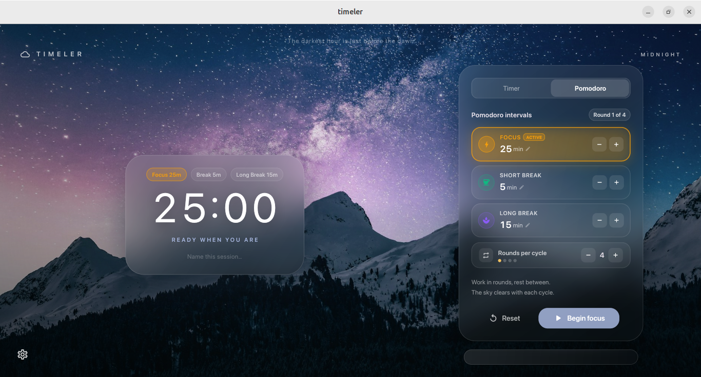
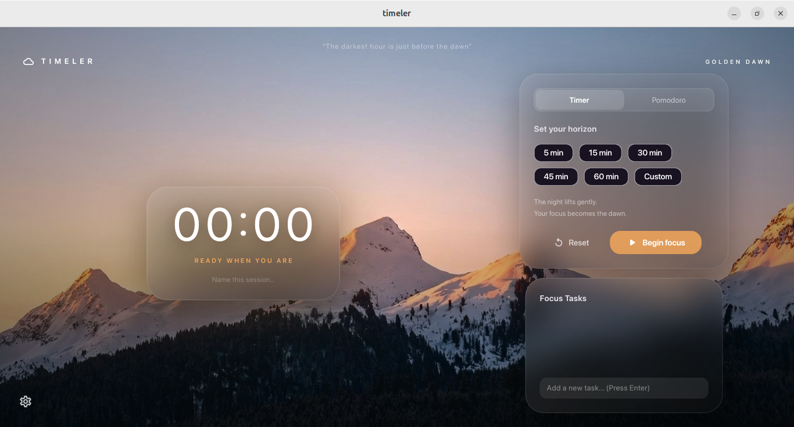
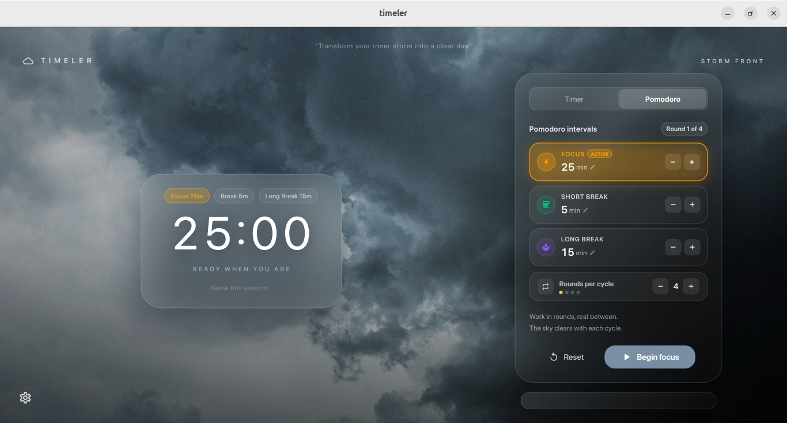
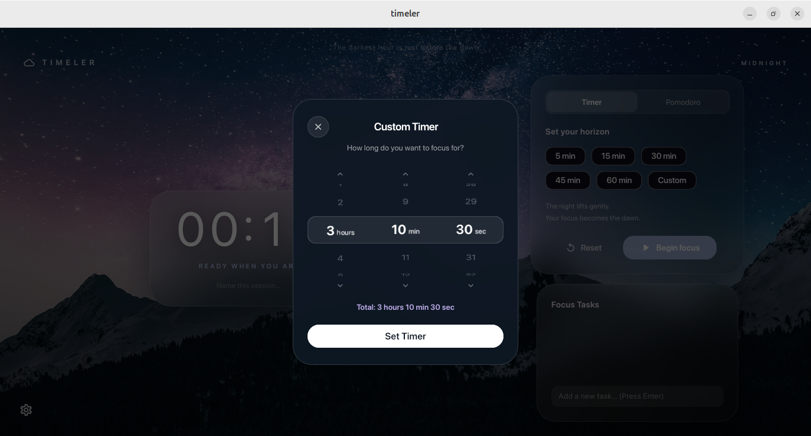
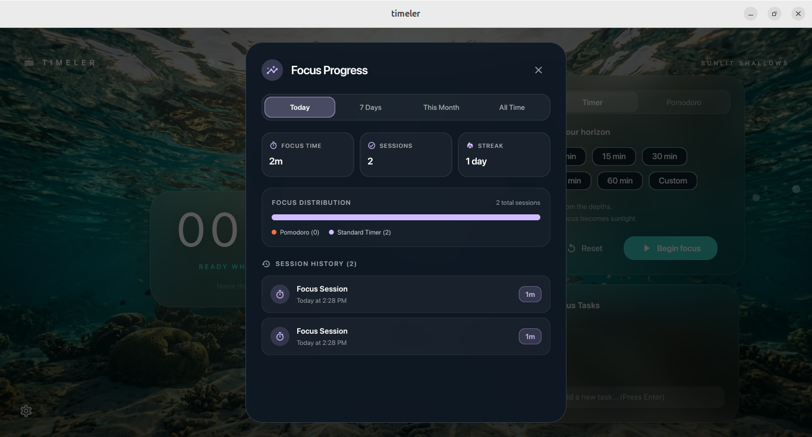
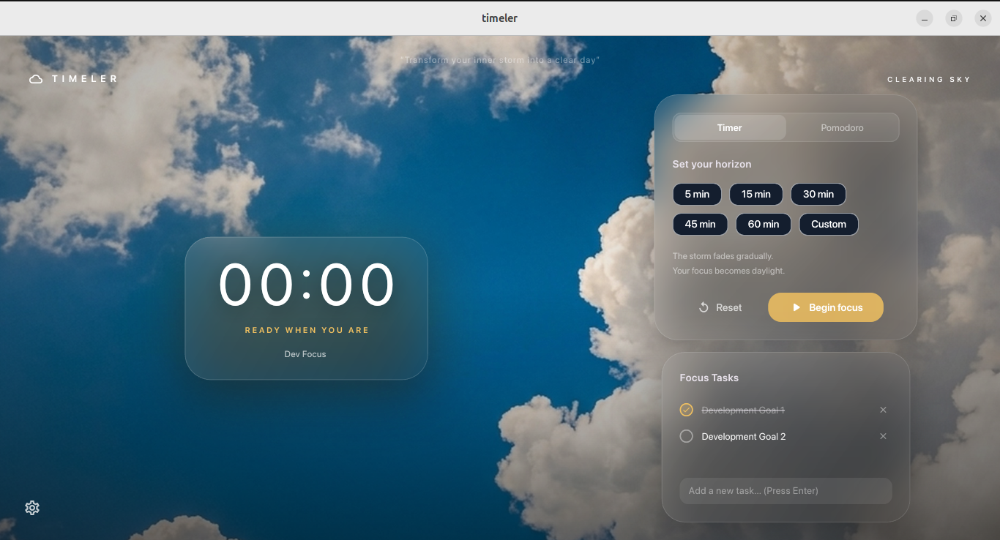

<div align="center">

  

  # ⏱️ Timeler

  **An immersive atmospheric focus & Pomodoro productivity suite for Linux.**  
  *Transform your workspace into living weather horizons that evolve as you work.*

  <br>

  [](https://snapcraft.io/timeler)

  <br>

  [](https://github.com/atharva2012tiwari/timeler/releases/latest)
  [](LICENSE)
  [](https://snapcraft.io/timeler)
  [](https://flutter.dev)
  [](README.md)
  [](https://github.com/atharva2012tiwari/timeler/stargazers)

  <br><br>

  <!-- HERO PREVIEW DEMO -->
  <a href="#-living-atmospheric-engine">
    
  </a>
  
  <p><i>Live session demo: Storm clouds gradually break open into a bright sunlit sky as focus completes.</i></p>

</div>

<br>

---

## 📑 Table of Contents

- [✨ Why Timeler?](#-why-timeler)
- [🌊 Living Atmospheric Engine](#-living-atmospheric-engine)
- [⏱️ 3-Option Pomodoro Suite](#️-3-option-pomodoro-suite)
- [🎛️ Precision Drum-Wheel Picker](#️-precision-drum-wheel-picker)
- [📊 Focus Analytics & Privacy](#-focus-analytics--privacy)
- [✅ Inline Focus Checklist](#-inline-focus-checklist)
- [🚀 Installation](#-installation)
  - [Canonical Snap Store (Universal Linux)](#1-snap-store-recommended-universal-linux)
  - [Ubuntu / Debian (`.deb`)](#2-ubuntu--debian-mint-pop_os-deb)
  - [Fedora / RHEL / openSUSE (`.rpm`)](#3-fedora--rhel--opensuse-rpm)
  - [Arch Linux / Generic Binary](#4-arch-linux--universal-tarball)
- [🛠️ Building from Source](#️-building-from-source)
- [🤝 Contributing & Community](#-contributing--community)
- [📄 License](#-license)

---

## ✨ Why Timeler?

Most timers are cold, sterile countdown clocks. **Timeler is built around emotional flow states.**

Grounding your deep work in dynamic natural transitions, Timeler rewards continuous focus by visually dissipating tension:
- **Zero Distractions**: Clean, glassmorphic acrylic aesthetics designed specifically for modern Linux desktops.
- **Organic Transitions**: Watch storm clouds fade into sunshine, or abyssal ocean depths rise to turquoise coral shallows as you reach the finish line.
- **Physics Particle Engines**: Real-time canvas particle systems for falling rain and shimmering bioluminescent bubbles.
- **100% Offline & Private**: No sign-ups, no tracking telemetry, no cloud subscriptions. All session history is kept locally on your machine.

---

## 🌊 Living Atmospheric Engine

Timeler features three hand-crafted dynamic environments that respond proportionally to your session progress:

| Starting State (Deep Focus) | Progression | Completion Horizon |
| :--- | :--- | :--- |
| ⛈️ **Storm Front** | Rain & dark thunderclouds begin to lift | ☀️ **Clearing Sky** — Pure blue skies & sun |
| 🌌 **Midnight Galaxy** | Silent starry expanse slowly brightens | 🌄 **Golden Dawn** — Warm alpine morning glow |
| 🌊 **Deep Abyss** | Bioluminescent darkness & rising bubbles | 🏝️ **Sunlit Shallows** — Turquoise waters & coral reef rays |

<br>

### Deep Ocean to Sunlit Shallows
Rise from the bottom of the Mariana Trench to sun-drenched coastal shallows as your timer runs:

| Deep Abyss (Session Start) | Sunlit Shallows (Session Complete) |
| :---: | :---: |
|  |  |

<br>

### Midnight to Golden Dawn
Work through the deep starry quiet of midnight until the alpine peaks ignite in golden sunrise:

| Midnight Galaxy (Session Start) | Golden Dawn (Session Complete) |
| :---: | :---: |
|  |  |

---

## ⏱️ 3-Option Pomodoro Suite

<div align="center">
  
</div>

A dedicated Pomodoro workspace engineered for rhythm and sustainability:
- **Three Distinct Glassmorphic Option Cards**:
  - ⚡ **Focus** (Warm Amber `#F59E0B`)
  - ☕ **Short Break** (Mint Emerald `#10B981`)
  - 🧘 **Long Break** (Lavender Purple `#8B5CF6`)
- **Instant Steppers**: Quick `[-]` and `[+]` buttons to tune intervals on the fly.
- **Cycle & Round Tracking**: Illuminated visual round markers indicating current cycle progression.
- **Step-by-Step Chime & Continue Workflow**: When a session finishes, a soothing native bell chime alerts you. The timer automatically pauses and presents an illuminated **"Continue to [Next Phase]"** button, waiting for your confirmation before starting your break.

---

## 🎛️ Precision Drum-Wheel Picker

<div align="center">
  
</div>

Need an exact duration for a meeting, coding sprint, or tea brew?
- **Tactile Drum Reels**: Independent smooth-scrolling wheels for **Hours**, **Minutes**, and **Seconds**.
- **Instant Chevron Steppers**: Quick increments/decrements with live calculation feedback.
- **Universal Application**: Accessible directly from standard timer presets or by tapping duration counters inside Pomodoro cards.

---

## 📊 Focus Analytics & Privacy

<div align="center">
  
</div>

Track your discipline and momentum over time:
- **Comprehensive Metrics**: Total focus time, completed sessions, and daily streak counters.
- **Dynamic Time Filters**: Switch between **Today**, **7 Days** (with visual daily bar charts), **This Month**, and **All Time**.
- **Focus Distribution Bar**: Compare time spent across structured Pomodoro blocks vs. freeform standard timers.
- **Complete Session History**: Timestamped ledger of all past focus blocks.
- **Local JSON Engine**: All analytics remain 100% strictly local in `~/.local/share/` / Snap storage.

---

## ✅ Inline Focus Checklist

<div align="center">
  
</div>

Keep your top priorities in sight without opening another heavy task manager:
- **Quick-Capture**: Type task title and press `Enter` to add.
- **Inline Completion**: Strikethrough checkbox and individual task deletion.
- **Session Naming**: Label your focus blocks (e.g. *"Dev Focus"*, *"Thesis Writing"*) to categorize your progress.

---

## 🚀 Installation

Timeler is packaged for all major Linux distributions.

### 1. Snap Store (Recommended · Universal Linux)
Available directly on Canonical's Snap Store for Ubuntu, Debian, Fedora, Arch, Manjaro, openSUSE, and Pop!_OS:

```bash
sudo snap install timeler
```

*Or open the **Ubuntu Software Center / Snap Store** GUI app and search for `timeler`.*

---

### 2. Ubuntu / Debian / Mint / Pop!_OS (`.deb`)
Download the latest pre-compiled `.deb` binary from [GitHub Releases](https://github.com/atharva2012tiwari/timeler/releases/latest):

```bash
# Download and install
wget https://github.com/atharva2012tiwari/timeler/releases/download/v1.1.0/timeler_1.1.0_amd64.deb
sudo dpkg -i timeler_1.1.0_amd64.deb

# If missing any dependencies, resolve with:
sudo apt-get install -f
```

---

### 3. Fedora / RHEL / openSUSE (`.rpm`)
Download the native RPM package from [GitHub Releases](https://github.com/atharva2012tiwari/timeler/releases/latest):

```bash
sudo dnf install https://github.com/atharva2012tiwari/timeler/releases/download/v1.1.0/timeler-1.1.0-1.x86_64.rpm
```

---

### 4. Arch Linux / Universal Tarball
Extract the portable standalone bundle anywhere:

```bash
# Download tarball
wget https://github.com/atharva2012tiwari/timeler/releases/download/v1.1.0/timeler-1.1.0-linux-x64.tar.gz

# Extract and run
tar -xzf timeler-1.1.0-linux-x64.tar.gz
./timeler/timeler
```

---

## 🛠️ Building from Source

### Prerequisites
- **Flutter SDK** (3.24.x or higher)
- **Linux Toolchain**:
  ```bash
  # Ubuntu / Debian
  sudo apt install clang cmake ninja-build pkg-config libgtk-3-dev libpulse-dev

  # Fedora
  sudo dnf install clang cmake ninja-build pkgconfig gtk3-devel pulseaudio-libs-devel
  ```

### Build & Run
```bash
# 1. Clone the repository
git clone https://github.com/atharva2012tiwari/timeler.git
cd timeler

# 2. Fetch packages
flutter pub get

# 3. Run on Linux desktop
flutter run -d linux

# 4. Build optimized release executable
flutter build linux --release
```

The compiled binary will be located at:
`build/linux/x64/release/bundle/timeler`

---

## 🤝 Contributing & Community

Contributions, issue reports, and design suggestions are warmly welcomed!

1. **Fork** the repository
2. **Create** your feature branch (`git checkout -b feature/amazing-feature`)
3. **Commit** your changes (`git commit -m 'Add amazing feature'`)
4. **Push** to the branch (`git push origin feature/amazing-feature`)
5. **Open** a Pull Request

⭐ **Enjoying Timeler?** Give the repository a star on GitHub — it helps more Linux users discover atmospheric focus!

---

## 📄 License

This project is open-source software licensed under the **MIT License**. See the [LICENSE](LICENSE) file for details.
